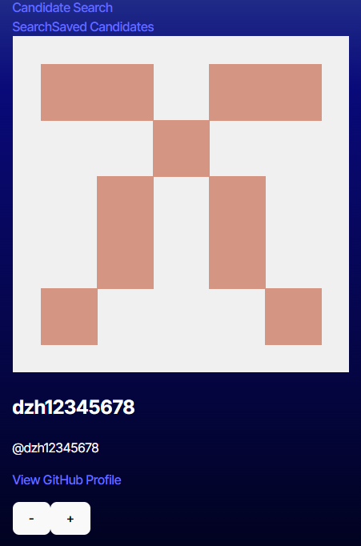
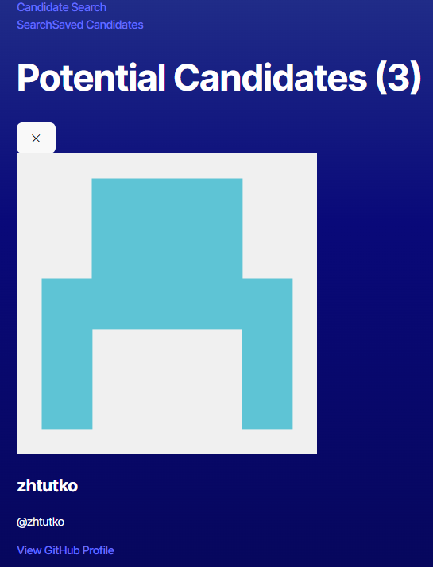

# GitHub Candidate Search Application

## Description
The GitHub Candidate Search Application is a web-based tool that helps employers find potential candidates by leveraging the GitHub API. The application allows users to browse through GitHub profiles, save interesting candidates, and manage a list of potential recruits.

## Features
- Random GitHub user discovery
- Detailed user profile viewing including:
  - Name
  - Username
  - Location
  - Avatar
  - Email
  - GitHub URL
  - Company information
- Save interesting candidates for later review
- Persistent storage of saved candidates
- Responsive design for mobile and desktop use
- Simple and intuitive interface with "+" and "-" actions

## Technologies Used
- React
- TypeScript
- Vite
- React Router
- GitHub REST API
- Local Storage for data persistence
- Tailwind CSS for styling

## Prerequisites
Before running this application, you need to have:
- Node.js (v14 or higher)
- npm (v6 or higher)
- GitHub Personal Access Token

## Installation
1. Clone the repository:
```bash
git clone [your-repository-url]
cd github-candidate-search
```

2. Install dependencies:
```bash
npm install
```

3. Create a `.env` file in the root directory and add your GitHub token:
```plaintext
VITE_GITHUB_TOKEN=your_github_token_here
```

4. Start the development server:
```bash
npm run dev
```

## Configuration
To set up your GitHub Personal Access Token:
1. Go to GitHub.com → Your Profile → Settings
2. Scroll to "Developer settings" → "Personal access tokens" → "Tokens (classic)"
3. Generate new token with the following permissions:
   - read:user
   - user:email

## Usage
1. **Main Search Page**:
   - View random GitHub user profiles
   - Click "+" to save a candidate
   - Click "-" to skip to the next candidate

2. **Saved Candidates Page**:
   - View all saved candidates
   - Access their GitHub profiles
   - Remove candidates from saved list

## Project Structure
```
src/
├── components/
│   └── Nav.tsx
├── pages/
│   ├── CandidateSearch.tsx
│   ├── SavedCandidates.tsx
│   └── ErrorPage.tsx
├── api/
│   └── API.tsx
├── interfaces/
│   └── Candidate.interface.tsx
├── App.tsx
└── main.tsx
```

## API Endpoints
The application uses the following GitHub API endpoints:
- `GET /users?since={id}` - Get random users
- `GET /users/{username}` - Get detailed user information

## Contributing
1. Fork the repository
2. Create your feature branch (`git checkout -b feature/AmazingFeature`)
3. Commit your changes (`git commit -m 'Add some AmazingFeature'`)
4. Push to the branch (`git push origin feature/AmazingFeature`)
5. Open a Pull Request

## License
This project is licensed under the MIT License - see the LICENSE.md file for details

## Acknowledgments
- GitHub API for providing the data
- React team for the amazing framework
- Vite team for the build tool
- All contributors who participate in this project

## Contact
Amit Nandy - [nandyamit.in@gmail.com]
Project Link: [https://github.com/nandyamit/Candidate-Search]

## Screenshots


